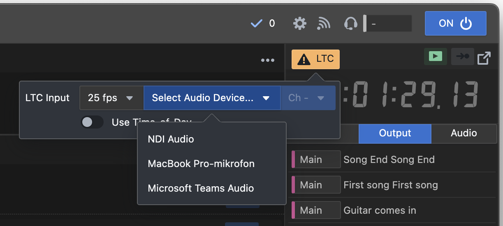
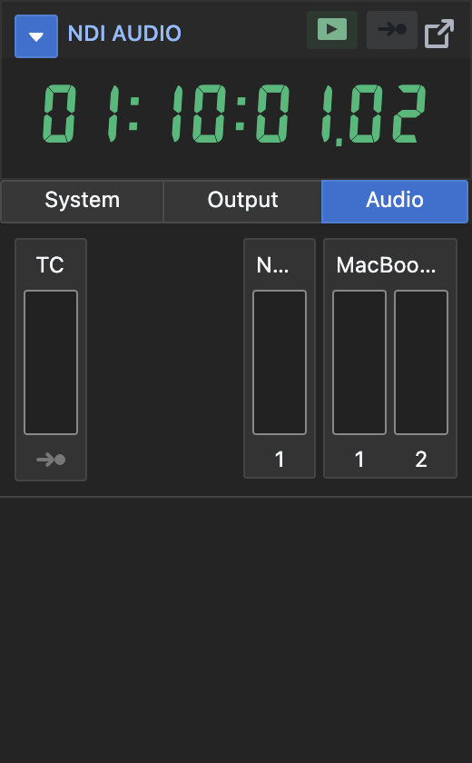

The last step is to setup the Timecode Input.

Click the LTC-Input button, to select audio interface, and channel.

Make sure to select the framerate of the signal. Either 25fps or 30fps.

When the timecode is running, the display should read the TC.

You can verify the timecode coming in, by going to the Audio Meters Pane

