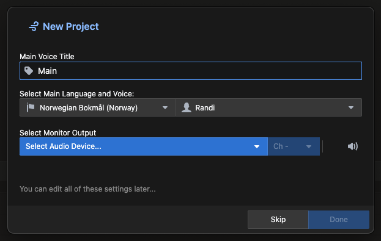

The first time you open a project, you are asked to enter what you would like to call the main voice. You can leave it empty if you prefer.

You must also specify which language you would like to use and select one of the available voices. Typically, there is one male and one female voice for each language. We have already preselected some of the best AI voices available for your language.

Lastly, you should specify the audio interface you prefer for editing and the channel on that interface you would like to use. If the app can access the device successfully, you will see a blue tick, and you can proceed by pressing the 'Done' button.

