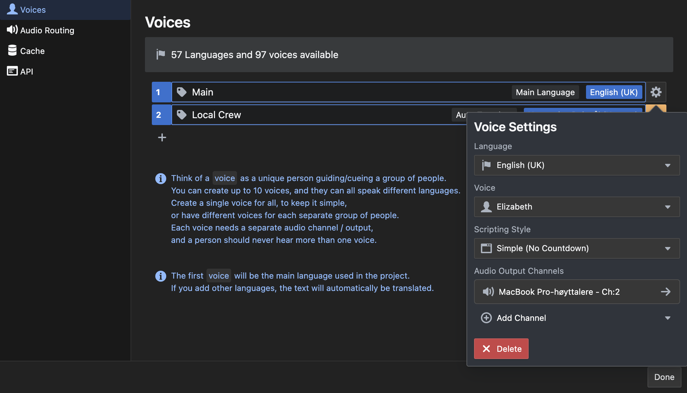

Think of a _voice_ as a unique person guiding/cueing a group of people.
You can create up to 10 voices, and they can all speak different languages.
Create a single voice for all, to keep it simple,
or have different voices for each separate group of people.
Each voice needs a separate audio channel / output,
and a person should never hear more than one voice.

The first voice will be the main language used in the project.
If you add other languages, the text will automatically be translated. Always go through the translations, to make sure there are no misunderstandings bound to happen. The translations are done with the google translate-API.

You can select between 2 different scripting-modes
-Simple
-Seconds
-Bars

#### Simple-mode

In this mode the voice will read out the statements at the exact time of the timecode

#### Seconds

In this mode the voice will count down to the exact time of the statement, and repeat the text in advance to make sure everyone knows what is coming

#### Bars

This mode works like seconds, but count down in bars instead. Its more musically and often preferred when working with music. Remember to set the correct BPM (Beats per minute) for the song, for this to work as expected.

Each voice can have a different mode - to let the receiver have the preferred method of preview.
