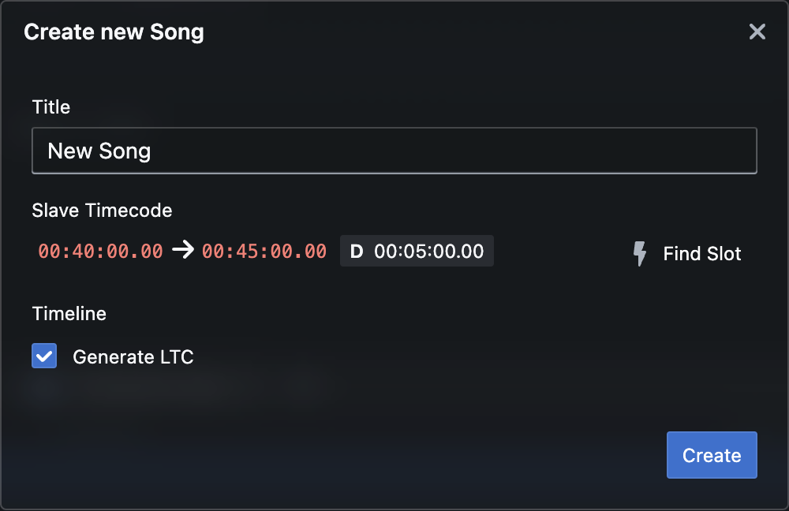

Start by creating a song.

Click '+' in the songs-navigator to the left.

Fill out the form.

The timecode you enter will determine the segment of the incoming timecode that applies to this song. Click 'Find Slot' to automatically locate a 5-minute unused segment. Use this feature only if you can accurately identify the timecodes in use. Typically, you'll receive the timecode information from those in charge of the tracks.

Once you've made your selections, click 'Create'.
The song will then be added to the 'Default Playlist' automatically.
