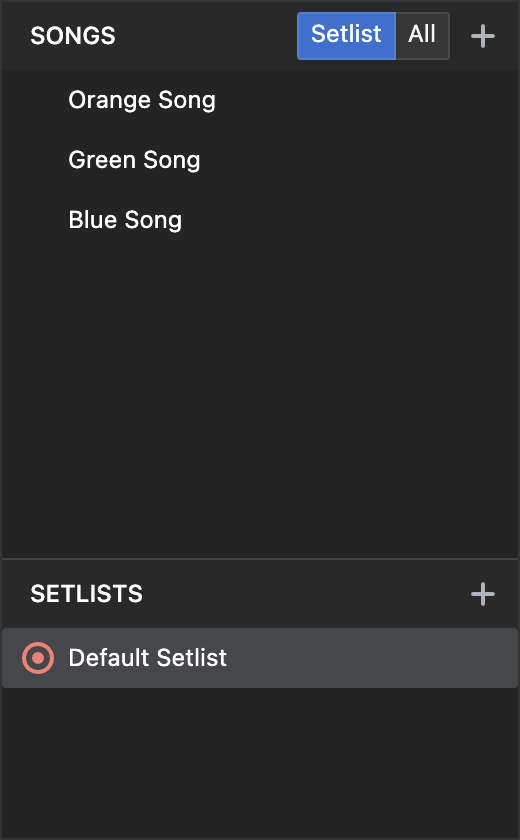

Start by creating a song.

Click '+' in the songs-navigator to the left.

Fill out the form.

The timecode you enter will be the part of the incoming timecode that will apply to this song.
Click 'Find Slot' to find a 5 minute unused segment automatically.
Only use this if you can decide what timecodes are being used.
Normally you will get the timecode-information from the ones in charge of the tracks.

And click 'create'
The song will be added to the 'Default Playlist' automatically.
