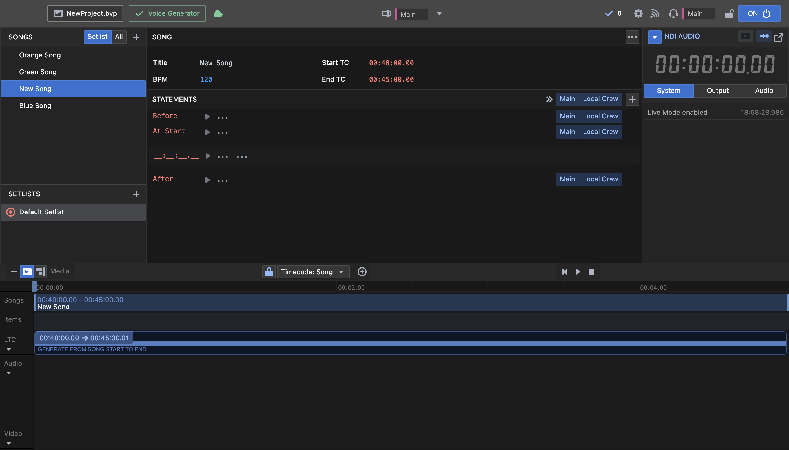

Now you can use the timeline at the bottom to navigate through the song.

Press CMD+L to insert a statement at the position of the playhead.

Alternatively, you can click directly inside the editor window and manually enter a timecode.

To synchronize logging with a video or audio file, simply drag it into the Timeline window.

Play through the timeline to preview what the voice will read.
